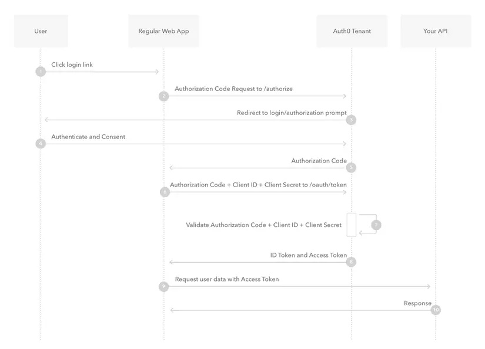

The complete chain:
- User -> Google (Login)
- Google -> Client -> Server (Callback Endpoint)
- Server (Exchanges Code for Token, creates User in DB)
- Server $\rightarrow$ Client (Final Redirect with Token)

For this architecture (Node.js backend + Mobile App), the industry standard is the JWT (JSON Web Token).

We do not use Cookies (which are great for browsers but terrible for mobile apps). We do not simply pass the user ID (which is insecure and easily faked).

We use a Signed JWT. Think of it like a laminated, stamping ID card issued by your server.