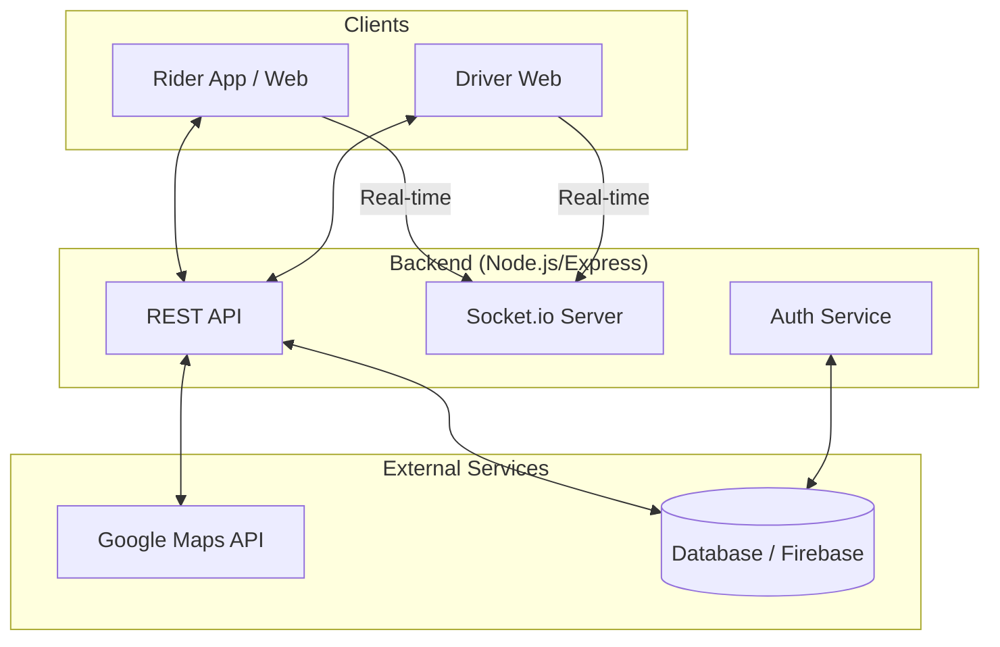

# Rider and Driver Apps Overview

This document provides a high-level overview of the ecosystem consisting of the Rider application, the Driver application, and the backend services that power them.

## System Ecosystem

The system follows a multi-client architecture where a central backend manages the orchestration between Riders (who need a ride) and Drivers (who provide the service).

### 1. Rider Application (`RiderWeb` & `RideGo`)
The Rider application is the interface for users to request rides.
- **Key Responsibilities**:
    - User authentication (Sign up/Login).
    - Map integration for selecting pickup and drop-off locations.
    - Ride type selection (e.g., standard, premium).
    - Real-time tracking of assigned drivers.
    - Fare estimation and payment processing.
    - Ride history and profile management.
- **Platforms**:
    - **Web**: Implemented in React (`RiderWeb`).
    - **Mobile**: Implemented in Kotlin for Android (`RideGo`).

### 2. Driver Application (`DriverWeb`)
The Driver application is designed for service providers.
- **Key Responsibilities**:
    - Driver onboarding and document verification.
    - Real-time availability toggle (Online/Offline).
    - Accepting or rejecting ride requests.
    - Navigation to pickup and destination points.
    - Trip status updates (Arriving, Picked Up, Completed).
    - Earnings and performance tracking.
- **Platform**: Currently implemented as a React web application (`DriverWeb`).

### 3. Backend Services (`my-server`)
The central hub implemented with Node.js and Express. It acts as the "brain" of the system.
- **Core Functions**:
    - **Matching Engine**: Identifies nearby available drivers when a rider makes a request.
    - **Real-time Orchestration**: Uses Socket.io to push updates to clients (e.g., "Driver is arriving").
    - **Security**: Manages authentication via JWT and Firebase.
    - **Data Persistence**: Stores users, trips, and location data in a MongoDB or Firestore database.

## Architecture Diagram

